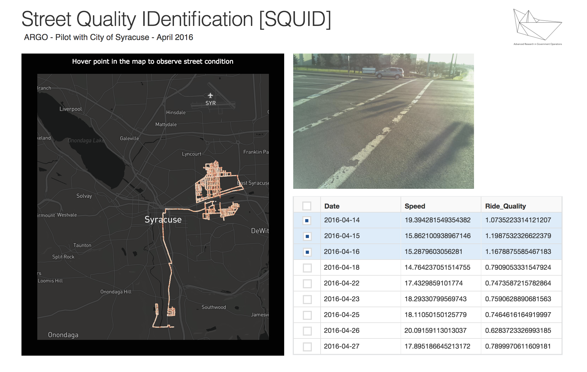

# SQUID-Syracuse-Dashboard

SQUID – or Street Quality Identification Device, is new technology developed by [ARGO Labs](http://www.argolabs.org). The technology consists of taking pictures of the streets (with a camera installed on a vehicle) every second, and combine this information with an accelerometer data, measuring the ride quality of the streets. The first city to use this technology is the city of Syracuse and the result is shown in the [dashboard below](https://squid-syracuse.herokuapp.com).

 
*IMPORTANT: I just built the dashboard, data collection and analysis was made by ARGO Labs team. 

You can see some references here: http://wrvo.org/post/squid-give-syracuse-better-feel-needed-road-repairs
 
Methods: Data Analysis (Python/R), Spatial Analysis (Geopy, Geopandas), Visualization (Plotly, Dash), Deployment (Heroku)
 
Dashboard: https://squid-syracuse.herokuapp.com
